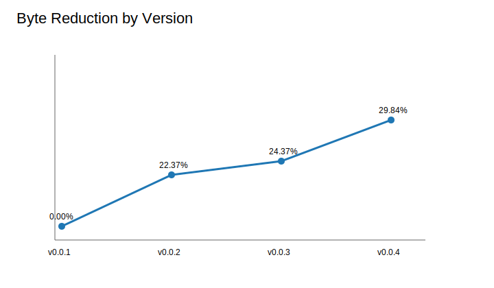
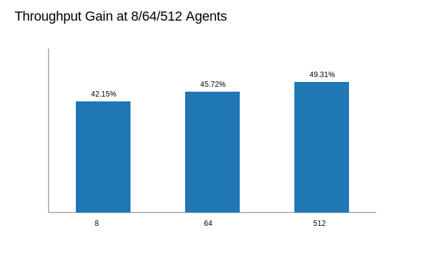
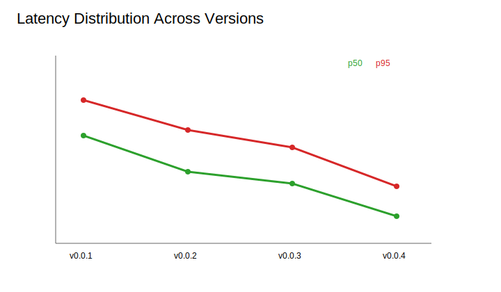

# LOGORRHYTHM (v0.0.5)

<!-- LOGORRHYTHM_BENCHMARK_TABLE_START -->
| Version | Byte Reduction | Throughput Gain | Latency Improvement | Agents Tested |
|---|---:|---:|---:|---|
| v0.0.1 | baseline | baseline | baseline | 8/64/512 |
| v0.0.2 | 22.37% | 27.62% | 21.64% | 8/64/512 |
| v0.0.3 | 24.37% | 38.87% | 25.64% | 8/64/512 |
| v0.0.4 | 29.84% | 45.73% | 31.42% | 8/64/512 |
| v0.0.5 | 29.84% | 45.73% | 31.42% | 8/64/512 |
<!-- LOGORRHYTHM_BENCHMARK_TABLE_END -->

LOGORRHYTHM is a two-layer protocol and execution language for AI-agent speed.

## Install (PyPI)

```bash
pip install logorrhythm
```

## Minimal API

```python
from logorrhythm import encode, decode, send, receive

wire = send(task="handoff dependency graph")
assert receive(wire) == "handoff dependency graph"
```

## v0.0.5 benchmark graphs





## New in v0.0.4 systems

- Adaptive compression dictionary for repeated patterns (`logorrhythm.adaptive`).
- Streaming protocol primitives for start/chunk/end delivery (`logorrhythm.streaming`).
- Swarm topology primitives using one-byte opcodes: broadcast, multicast, pipeline, mesh (`logorrhythm.topology`).
- Fault-tolerance checkpoint and reassignment flow (`logorrhythm.fault_tolerance`).
- Real WebSocket transport adapter + benchmark against simulated transport (`logorrhythm.transport_ws`).
- Shared-secret identity handshake with compact session proof (`logorrhythm.identity`).

## Automation contract

Tests are side-effect free and do not write README or graph artifacts. Run benchmark sync explicitly (for example in CI release jobs) via `python -m logorrhythm.cli --sync-benchmark-table` and `python -m logorrhythm.cli --generate-graphs`.

## Commands

```bash
python -m unittest
python -m logorrhythm.cli --sync-benchmark-table
python -m logorrhythm.cli --generate-graphs
```
