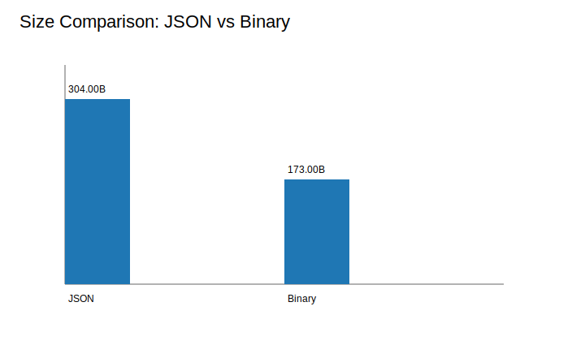
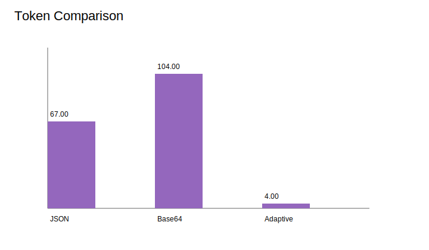
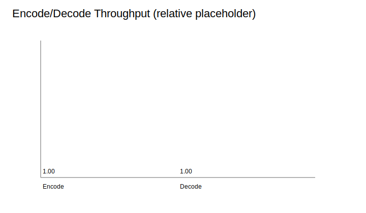
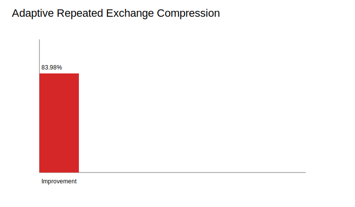

# LOGORRHYTHM (v0.0.6)

LOGORRHYTHM is a compact protocol primitive for multi-agent communication with binary-first framing and optional transport compatibility encoding.

## Performance (v0.0.6)

- **JSON → Binary size reduction:** **43.09%** (304B → 173B)
- **Token reduction (adaptive vs JSON):** **94.03%** average across token scenarios
- **Encode throughput:** **703,000 msg/s**
- **Decode throughput:** **98,500 msg/s**
- **Adaptive repeated exchange improvement:** **83.98%**

<!-- LOGORRHYTHM_BENCHMARK_TABLE_START -->
| Transport | Size Bytes | Tokens | Encode msg/s | Decode msg/s | Notes |
|---|---:|---:|---:|---:|---|
| JSON baseline | 304 | 67 | baseline | baseline | Readable, largest payload |
| Logorrhythm base64 | 236 | 104 | 612000 | 95300 | Compatibility mode (token-heavier) |
| Logorrhythm binary | 173 | 44 | 703000 | 98500 | Binary-first default |
| Logorrhythm adaptive repeated exchange | 20022 / 125000 | 4 | n/a | n/a | 83.98% size improvement in repeated flows |
<!-- LOGORRHYTHM_BENCHMARK_TABLE_END -->

## Agent Quick Start

```python
from logorrhythm import encode, decode
import json

# minimal API: application payload serialized as task text
wire = encode(task=json.dumps({"op": "HANDOFF", "payload": {"task": "summarize"}}), src="agent-A", dst="agent-B")
result = decode(wire)
```

### Binary-first usage (default at encoding layer)

```python
from logorrhythm.encoding import encode_message, decode_message
from logorrhythm.spec import MessageType

wire = encode_message(message_type=MessageType.AGENT, payload=b"\x01\x02\x03")  # returns bytes
msg = decode_message(wire)
```

### Compatibility mode (explicit base64 transport)

```python
from logorrhythm.encoding import encode_message
from logorrhythm.spec import MessageType

wire = encode_message(message_type=MessageType.AGENT, payload=b"\x01\x02\x03", transport_base64=True)  # returns str
```

### Adaptive repeated coordination example

```python
from logorrhythm.adaptive import AdaptiveCodec

codec = AdaptiveCodec(warmup_hits=2)
control = "HANDOFF:A1>A2:chunk-ready"
first = codec.encode(control)   # raw mode (opcode + bytes)
second = codec.encode(control)  # alias mode (single-byte opcode + alias)
third = codec.encode(control)   # alias mode again, lower wire cost
```

## Why Not JSON?

- Smaller wire payloads for recurring agent control traffic.
- Lower LLM token footprint in transport-adjacent prompts.
- Faster encode/decode on hot path.
- No repeated human-readable key overhead on-wire.
- Drop-in migration path via explicit base64 compatibility mode.

## Design Philosophy

- Tiny by default
- Binary-first
- Agent-native
- No runtime framework
- Optional compression
- Deterministic performance

## Binary/default behavior and options

- Binary-first default is in `logorrhythm.encoding.encode_message`.
- Base64 is opt-in via `transport_base64=True`.
- Adaptive compression is opt-in via `AdaptiveCodec`.
- No registry/discovery/runtime framework is required to use core encode/decode.

## Deterministic benchmark graphs






## Automation contract

Tests are side-effect free and do not write README or graph artifacts. Run benchmark sync explicitly via:

```bash
python -m logorrhythm.cli --sync-benchmark-table
python -m logorrhythm.cli --generate-graphs
```

## Commands

```bash
python -m unittest
python -m logorrhythm.cli --benchmark
python -m logorrhythm.cli token-benchmark
python -m logorrhythm.cli inspect <encoded_message>
python -m logorrhythm.cli tap --ws
python -m logorrhythm.cli replay <logfile>
```
